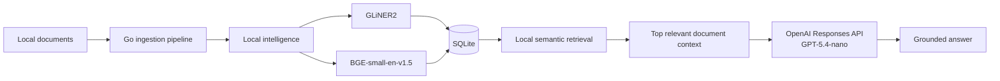
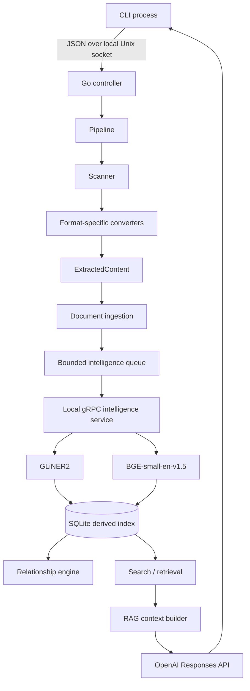
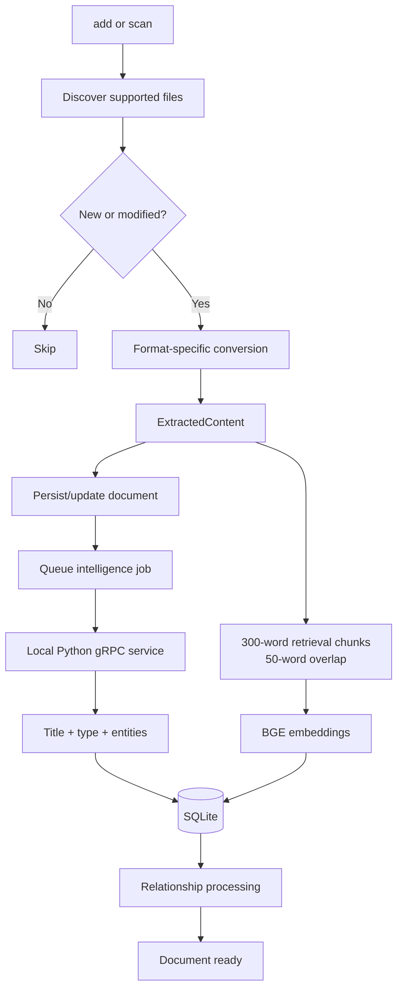
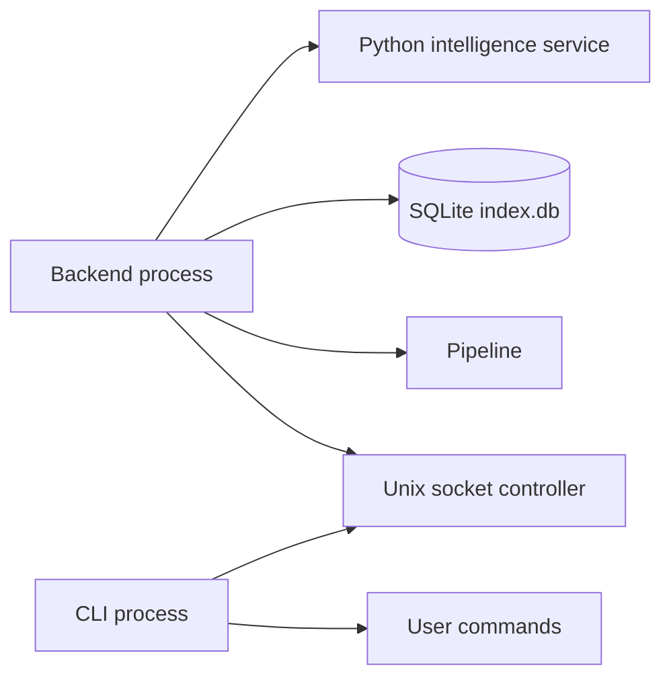

# PaperTrail

PaperTrail is a privacy-first local document archive and intelligence engine.
It scans local folders, converts supported documents into a common representation,
extracts document intelligence locally, builds an entity and relationship graph,
creates semantic retrieval indexes, and provides RAG-based question answering.

The core design is **local retrieval + remote generation**:

- Original documents remain on the user's machine and remain the source of truth.
- Go owns scanning, conversion, ingestion, persistence, relationships, retrieval,
  RAG orchestration, and the CLI/control plane.
- Python owns local ML inference through a gRPC service.
- GLiNER2 provides document intelligence such as title, document-type, and entity extraction.
- BGE provides the embeddings used for semantic retrieval.
- SQLite stores the durable derived index, including chunks and embeddings.
- OpenAI is used only for final RAG answer synthesis.

The important privacy boundary is therefore:



Only the retrieved context required to answer an `ask` request is sent to OpenAI.
The original archive is never uploaded.


---

## 1. Current implementation overview

PaperTrail currently runs as a backend process plus a separate CLI process.

```text
Terminal 1
  make start
      |
      +-- Go backend
      |    +-- Unix-socket controller
      |    +-- scanner
      |    +-- converters
      |    +-- pipeline workers
      |    +-- SQLite
      |    +-- search / RAG
      |    +-- backend logs
      |
      +-- local Python intelligence service
           +-- GLiNER2
           +-- BGE-small-en-v1.5

Terminal 2
  ./bin/papertrail --cli
      |
      +-- add <folder>
      +-- remove <folder>
      +-- folders
      +-- scan
      +-- documents
      +-- document <uuid>
      +-- entity <uuid>
      +-- ask <question>
      +-- status
      +-- help
      +-- exit
```

The CLI is intentionally lightweight. It communicates with the running backend
through a local Unix socket using JSON messages. It does not own the database,
pipeline, Python service, or backend logging.

### High-level architecture



---

## 2. Design decisions

### 2.1 Original files remain the source of truth

PaperTrail does not replace the archive with a database copy.
The filesystem remains authoritative. SQLite stores derived/indexed information:

- document metadata
- entities
- document/entity mappings
- document relationships
- relationship/entity mappings
- retrieval chunks
- embeddings
- indexing state

The derived index can therefore be rebuilt from the original archive.

### 2.2 Go for application logic, Python for ML

Go owns deterministic application concerns:

- folder management and scanning
- file change detection and fingerprinting
- converter dispatch
- ingestion and pipeline orchestration
- stale-result protection
- normalization and confidence filtering
- SQLite persistence
- relationship processing
- semantic retrieval
- RAG orchestration
- CLI/controller lifecycle

Python owns model inference:

- title extraction
- document classification
- entity extraction
- embedding generation

The Go/Python boundary is local gRPC. This isolates model-specific code from the
application and storage layers.

### 2.3 Format-neutral document model

Every converter produces the same `ExtractedContent` representation.

```text
source file
    |
    +--> TXT / PDF / DOCX / EPUB / CSV / XLSX / PPTX
                  |
                  v
          ExtractedContent
                  |
                  v
             intelligence
```

The intelligence, relationship, retrieval, and storage layers do not need
format-specific processing branches.

### 2.4 Fingerprint-safe incremental processing

A source file can change while model inference is still running. PaperTrail carries
the source fingerprint through processing and verifies that the result still belongs
to the current source version before committing derived intelligence.

This prevents stale inference results from overwriting newer document state.

### 2.5 Bounded intelligence processing

ML inference is more expensive than scanning and ingestion. The pipeline therefore
uses a bounded worker queue rather than allowing an unrestricted number of documents
to trigger model work concurrently.

This keeps resource usage predictable while separating scanning from inference.

### 2.6 Entity and relationship graph

Entities are extracted locally and canonicalized in Go/storage using normalized type
and value information.

Relationships are stored explicitly rather than being calculated only at display
time. They retain supporting entities and confidence information, making the graph
explainable.

### 2.7 SQLite as the durable local index

SQLite is the single durable storage layer for the derived index.

It is intentionally used instead of introducing a separate database or vector
service at this stage. Keeping the index in one local database simplifies backup,
portability, startup, and development.

---

## 3. Document processing flow



### Stage 1: discovery

The scanner walks configured folders and discovers supported files.

### Stage 2: change detection

The current file state is compared against the derived index using source metadata
and fingerprints.

New and modified files are processed. Unchanged files are skipped.

### Stage 3: conversion

A format-specific converter extracts source content and available format metadata
into `ExtractedContent`.

Converters are deliberately unaware of ML, relationships, retrieval, or storage.

### Stage 4: local intelligence

Extracted content is processed by the local Python intelligence service.
GLiNER2 performs document intelligence and BGE creates embeddings used by retrieval.

Go applies confidence thresholds and normalizes the returned results before
persisting them.

### Stage 5: indexing

Document metadata, entities, relationships, chunks, and embeddings are stored in
SQLite. The source file itself is never copied into the database.

### Stage 6: retrieval

For an `ask` request, only the question is newly embedded. Existing document chunk
embeddings are reused.

### Stage 7: answer synthesis

The most relevant chunks are combined with document metadata and passed to the
OpenAI Responses API. The generated answer is returned to the CLI.

---

## 4. Embedding design

PaperTrail uses:

`BAAI/bge-small-en-v1.5`

The same embedding model is used for both document chunks and user questions.
This is required so both vectors live in the same embedding space.

### Embedding decisions

- 384-dimensional vectors
- normalized embeddings
- `float32` representation
- embeddings stored directly in SQLite
- document embeddings generated once during indexing
- only the user question is embedded again during retrieval

PaperTrail does **not** regenerate document embeddings for every question.

### Chunking decisions

Documents are split into retrieval chunks of up to 300 words with 50 words of
overlap.

The overlap preserves context across chunk boundaries while keeping retrieval
units small enough to provide focused evidence to the answer model.

Embedding requests are made in batches of 32 during indexing.

### Storage representation

Embeddings are stored as little-endian `float32` bytes in SQLite.
The storage layer validates the expected 384-dimensional vector size before writing.

This catches model/dimension mismatches at the storage boundary instead of allowing
invalid vectors into the index.

---

## 5. RAG architecture

PaperTrail implements a retrieval-augmented generation flow where retrieval is local
and answer generation is remote.


### RAG retrieval sequence

1. The user runs `ask <question>`.
2. The CLI sends the question to the backend controller.
3. The backend embeds the question using local BGE.
4. The query vector is compared with the existing chunk embeddings in SQLite.
5. The most relevant chunks are selected.
6. Corresponding document metadata is fetched.
7. The backend builds a limited context from those chunks and metadata.
8. The context and question are sent to OpenAI.
9. The generated answer is returned to the CLI.

### Retrieval implementation decision

The current implementation intentionally avoids a separate vector database or
vector extension. Similarity search is performed against the embeddings already
stored in SQLite.

This is a deliberate first implementation choice:

- one durable local datastore
- no additional infrastructure
- simple operational model
- easy debugging
- easy future migration if scale requires a specialized vector index

---

## 6. OpenAI integration

OpenAI is used only for final answer synthesis.

The Go application uses the official OpenAI Go SDK and the Responses API.
The current answer model is:

`gpt-5.4-nano`

The OpenAI layer does **not** generate document embeddings and does not participate
in normal document indexing.

The model receives:

- the user's question
- the retrieved document context

It does not receive the entire archive or the SQLite database.

### OpenAI request flow

```text
User question
     |
     v
Local BGE embedding
     |
     v
SQLite similarity retrieval
     |
     v
Top chunks + document metadata
     |
     v
OpenAI Responses API
     |
     v
Answer
```

This creates a clear privacy boundary between local indexing/retrieval and remote
answer synthesis.

---

## 7. Current intelligence configuration

The Python service loads the models once during startup:

- `fastino/gliner2-base-v1` — document intelligence
- `BAAI/bge-small-en-v1.5` — embeddings

The Go/Python contract is defined in:

`internal/intelligence/proto/intelligence.proto`

Active gRPC operations include:

- `Health`
- `Extract`
- `ExtractBatch`
- `Embed`

### Confidence thresholds

Go applies the current thresholds before persistence:

- title: `0.50`
- document type: `0.70` (otherwise `other`)
- entity: `0.80`

These thresholds are intentionally kept in the Go application layer so model output
can be normalized and validated before it affects the durable index.

---

## 8. Entity and relationship model

PaperTrail stores entities independently from documents.

Entities are canonicalized using normalized type/value information so the same
logical entity can be referenced by multiple documents.

The relationship engine creates explicit document relationships using shared
entities and metadata patterns.

Relationships keep their supporting information and confidence values, which makes
the resulting graph explainable and inspectable.

The current design prefers explicit relationships over an opaque graph model because
PaperTrail needs to be able to explain why two documents are related.

---

## 9. Storage model

The main SQLite tables are:

```text
documents
entities
document_entities
document_relationships
relationship_entities
chunks
```

The `documents` data includes source information such as:

- source path
- filename
- extension
- size
- modified time
- fingerprint
- title
- document type
- author
- creator
- intelligence status

The `chunks` table contains:

- document ID
- chunk index
- chunk text
- embedding
- creation timestamp

SQLite is configured for local use with foreign keys and WAL support. The current
storage layer uses a single persistent connection so connection-scoped SQLite
configuration remains predictable.

---

## 10. Supported document formats

Currently implemented:

- TXT
- PDF with embedded text extraction
- PDF author/creator metadata extraction
- DOCX
- EPUB
- CSV
- XLSX
- PPTX

Not currently implemented:

- OCR for scanned/image-only PDFs
- legacy `.doc`

OCR is intentionally separate from the current converter implementation and remains
future scope.

---

## 11. Runtime architecture

The executable has two modes.

### Backend mode

The default executable starts:

- the local Python intelligence service
- the SQLite index
- the pipeline worker
- the Unix-socket controller
- backend-side logging

### CLI mode

```bash
./bin/papertrail --cli
```

The CLI connects to the already-running backend and acts as the user-facing control
plane.

### Runtime diagram



The backend terminal remains responsible for backend/pipeline/ML logs. The CLI
terminal is intentionally kept as the user-facing command interface.

### Terminal handling

The project includes platform-aware terminal launch handling for the current target
platforms:

- Linux
- WSL
- Windows

The goal is to let the backend/CLI workflow open the required terminal environment
without requiring manual terminal construction for every operating system.

---

## 12. Environment configuration

Create a `.env` file in the repository root.

```bash
OPENAI_API_KEY=your_openai_api_key_here
```

Do not commit `.env` to source control.

The `make start` flow sources `.env` before starting PaperTrail so the OpenAI Go
client can read `OPENAI_API_KEY` from the environment.

If an `.env.example` is added to the repository, it should contain only the variable
name and a placeholder value, never a real API key.

---

## 13. Version requirements

Current development/runtime requirements:

- Go `1.27.1`
- Python `3.x`
- Python virtual environment at `.venv`
- `protoc`
- Go and Python gRPC/protobuf tooling
- SQLite through `modernc.org/sqlite`
- OpenAI API access for the `ask` / RAG flow

The first intelligence-service startup may download local model assets, so initial
setup requires network access and enough local disk space for the models.

---

## 14. Build and run sequence

Run all commands from the repository root.

### Step 1: create `.env`

```bash
cat > .env <<'EOF'
OPENAI_API_KEY=your_openai_api_key_here
```

Replace the placeholder with the real OpenAI API key.

### Step 2: setup Python

```bash
make setup
```

This creates the Python virtual environment and installs the dependencies required
by the local intelligence service.

### Step 3: generate protobuf code

```bash
make proto
```

This regenerates the Go and Python gRPC bindings from the shared
`internal/intelligence/proto/intelligence.proto` definition.

### Step 4: build PaperTrail

```bash
make build
```

This produces:

```text
bin/papertrail
```

### Step 5: start the backend

```bash
make start
```

The backend process:

1. loads `.env`
2. starts the local Python intelligence service
3. waits for the intelligence service to become ready
4. opens the SQLite index
5. starts the pipeline worker
6. starts the Unix-socket controller
7. remains attached to the terminal for backend, pipeline, and ML logs

### Step 6: index a folder

Inside the CLI:

```text
add <folder>
```

Adding a folder immediately triggers a scan of that folder.

### Step 7: inspect the index

```text
folders
documents
status
document <uuid>
entity <uuid>
```

### Step 8: ask a question

```text
ask <question>
```

The RAG path is:

```text
question
   ↓
local BGE query embedding
   ↓
SQLite similarity search over stored chunk embeddings
   ↓
top relevant chunks + document metadata
   ↓
OpenAI Responses API
   ↓
grounded answer
```

### Step 9: stop PaperTrail

From the CLI:

```text
exit
```

`exit` shuts down the backend through the controller, allowing the pipeline and
Python intelligence service to terminate cleanly.

### Complete first-run sequence

```bash
# repository root
cat > .env <<'EOF'
OPENAI_API_KEY=your_openai_api_key_here
EOF

make setup
make proto
make build
make start
```

Then:

```text
add /path/to/documents
documents
document <id>
help
ask What documents mention the same organisation as this contract?
```

### Validation

```bash
make test
make sca
```

### Cleanup

```bash
make clean
make deep-clean
```

`make clean` removes generated build/runtime data. `make deep-clean` additionally
removes the Python virtual environment.

---

## 15. CLI commands

```text
add <folder>
remove <folder>
folders
scan
documents
document <uuid>
entity <uuid>
ask <question>
status
help
exit
```

Folder configuration currently lives in the running controller process and is not a
separate persistent configuration store.

---

## 16. Current implementation scope

### Implemented

- TXT
- PDF embedded-text extraction and PDF author/creator metadata
- DOCX
- EPUB
- CSV
- XLSX
- PPTX
- local document classification
- local title extraction
- local entity extraction
- entity normalization/deduplication
- document relationships
- fingerprint-safe incremental processing
- bounded intelligence processing
- 300-word retrieval chunks with 50-word overlap
- BGE-small embeddings
- 384-dimensional normalized embeddings
- embeddings stored in SQLite
- local semantic chunk retrieval
- RAG question answering
- OpenAI Responses API answer synthesis
- CLI/backend separation through a Unix socket

### Not implemented yet

- OCR for scanned/image-only PDFs
- graphical UI
- persistent watched-folder configuration
- richer hybrid retrieval combining structured filters with semantic retrieval
- scalable vector indexing for very large archives

---

## 17. Scope for improvement

The next improvements should build on the current architecture rather than replace it.

### Retrieval

- improve ranking quality using real-document evaluation
- combine semantic retrieval with filename, metadata, entity, and date filters
- improve multi-document question answering
- introduce a more scalable vector-search structure only when SQLite full-scan
  retrieval becomes a practical bottleneck

### Document understanding

- OCR for image-only/scanned documents
- evaluate extraction quality on a larger real-document corpus
- improve relationship quality based on observed failure cases

### Product experience

- graphical desktop UI
- richer document and entity views
- better backend/indexing status visibility
- persistent folder configuration

### Operational maturity

- indexing metrics and diagnostics
- clearer background-job status and logs
- stronger recovery behavior for failed intelligence jobs
- performance tuning for large document archives

---

## 18. Design summary

PaperTrail intentionally keeps the document understanding and retrieval work local
while using an LLM only where generative reasoning is useful.

The key boundary is:

```text
LOCAL
  Scanner
      ↓
  Converter
      ↓
  Go pipeline
      ↓
  GLiNER2 + BGE
      ↓
  SQLite chunks + embeddings
      ↓
  Local semantic retrieval

REMOTE
  Retrieved context
      ↓
  OpenAI Responses API
      ↓
  Answer
```

This gives PaperTrail a local document intelligence and retrieval core while keeping
the RAG generation step simple, grounded, and replaceable.
